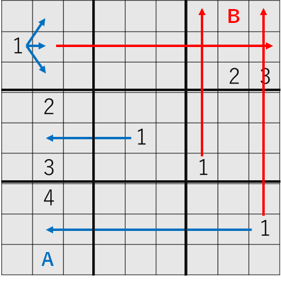

# 問題: 難易度と面白さを考慮したナンプレの自動作成問題

公式サイト: https://opthub.ai/ja/problems/number-place

## 概要

目的＝より面白いナンプレを自動作成すること

> この問題は難易度と面白さを考慮してナンプレの問題のヒントを自動作成する最適化問題です。
> ユーザの送信したヒントから、あらかじめ決められた手順を使ってナンプレを解くことで盤面の状態変化と、各盤面の難易度を判定します。
> 各局面の難易度を元に、問題の"ヤマ"のタイミングと、連鎖的な数字の決定を見つけることで面白さを評価します。
> (公式より)

- 「面白い」の定義とは？
  1. ヒント数: 多いほど簡単に、少ないほど難しい。また、配置の仕方はどうか。
  - 良いナンプレは線対称・点対象にヒントが置かれがち
  2. 手筋: 様々な数字の決定方法がある。手法として初心者向け～上級者向けまで
  - 良いナンプレは適度に難しい盤面が現れがち
  3. 連鎖: 盤面で連鎖的に数字を決定できるか。
  - 良いナンプレは連鎖的な盤面が存在しがち

## 評価方法

### 手筋による評価過程 (難易ピーク度の算出)

- ブロッケン: 1
- レッツミー: 2
- マスミ: 5
- いずれにしても: 5 ~ 15 (細かな手筋の違いで変動)
- 予約: 10 ~ 25 (細かな手筋の違いで変動)
- 井桁: 35

複数手番が打てる盤面では、最も高い手筋による評価が難易ピーク度として点数となる。

##### ex.レッツミー(赤)・ブロッケン(青)が打てる盤面

複数手が打てる場合には、最も点数が高い手筋が評価として採用される。  
その後モンテカルロ木探索（完全ランダムではなく、選ばれやすい手筋が存在）によって、実際にどの手筋を使うか決定し、次の手番となる。

### 緊張感による最終評価（難易ピーク度の離れ具合）

難易ピーク度が 1,2 番目にそれぞれ高い手番数がどれだけ離れているのかによる評価が最終となる。

## 形式

- 0 から 9 の整数の 81 次元配列
  - 0 は空マス
  - 1 から 9 はそれぞれの数字がマス
