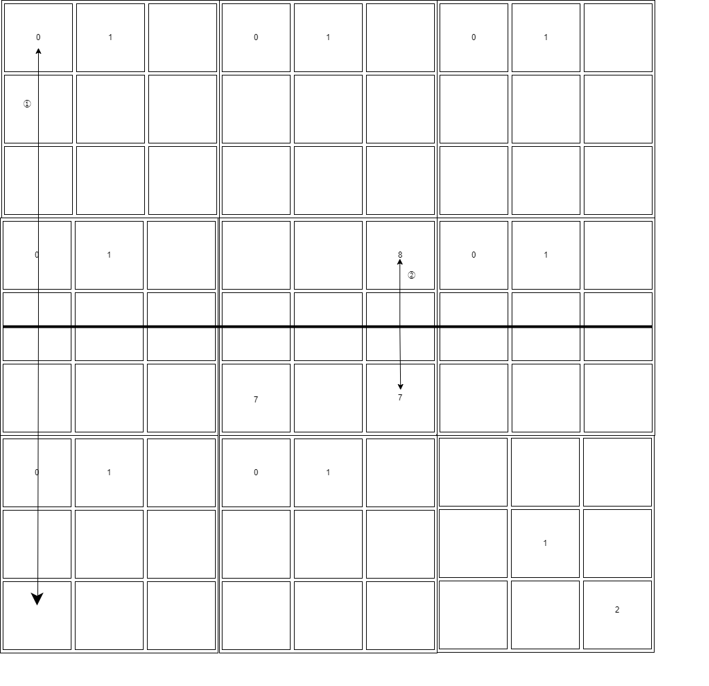
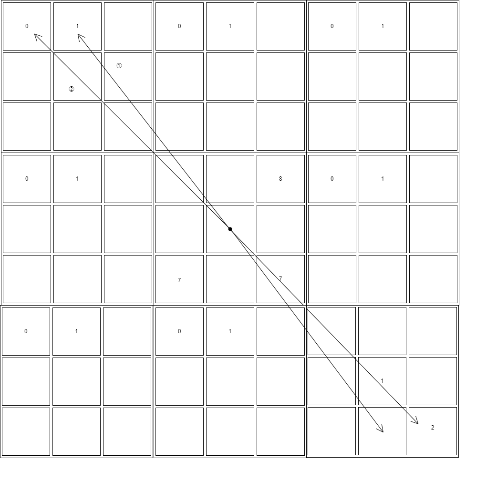

# 開発・実装方針

# ナンプレ盤の定義

9x9 盤面なので、先頭を(0,0)として、右下へとインデックスを増やしていく。

# 解法の方針

基本方針とは、盤における線対称・点対称における類似度を算出して、その類似度が現在判明している最適解の類似度により近くなるように解を新規に生成していく。

## 線対称の類似度算出

線対称の場合は中心を通る線を基に、各マスごとに対応する対象位置のマスを確認する。
片方のマスにヒントが入っている・もう片方に入っていない場合には、ユーグリット距離を算出して非類似的な要素であるものとして考慮する。

最終的にすべてを加算することで類似度として算出する。
なお、これを縦線・横線・左上から右下への線・右上から左下の線と、4 つの線対称で算出し、最終的な結果を 4 等分する。

例としては以下の画像の通り。
① の場合、数字が片方に入っている・もう片方に入っていないため、非類似な要素であるといえ、マンハッタン距離を算出（=8）
② の場合、数字が両方に入っているため、類似な要素であるといえ、何もしない。

## 点対称の類似度算出

線対称の計算方法を点対称で考慮したもの。

例としては以下の画像の通り。
① の場合、数字が片方に入っている・もう片方に入っていないため、非類似な要素であるといえ、マンハッタン距離を算出（=10）
② の場合、数字が両方に入っているため、類似な要素であるといえ、何もしない。

